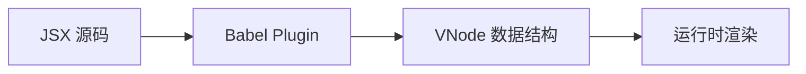

# 🚀 Vanilla DOM

高性能的 Web 客户端渲染库，专注于原生 DOM 操作和 JSX 支持，通过编译时优化实现极致性能。

[](https://opensource.org/licenses/MIT)
[](https://www.typescriptlang.org/)

## ✨ 特性

- 🎯 **专注客户端**: 纯浏览器渲染，无 SSR 包袱
- ⚡ **极致性能**: 编译时优化 + 运行时精确更新
- 📦 **轻量级**: 核心包 < 10KB gzipped
- 🔧 **零配置**: `.tsx` 文件开箱即用
- 🎨 **JSX 支持**: 完整的 JSX 语法和类型安全
- 🚀 **现代化**: ES2020+ 语法，TypeScript 优先

## 📦 包结构

### 核心包

| 包名                                                   | 功能                                        | 状态      | 大小 |
| ------------------------------------------------------ | ------------------------------------------- | --------- | ---- |
| [`@vanilla-dom/core`](./packages/core)                 | 核心渲染引擎 + DOM 工具集 + TypeScript 支持 | ✅ 完成   | ~6KB |
| [`@vanilla-dom/babel-plugin`](./packages/babel-plugin) | JSX 编译插件                                | 🚧 开发中 | ~2KB |
| [`@vanilla-dom/widget`](./packages/widget)             | 组件化抽象层                                | 📋 计划中 | ~3KB |

## 🚀 快速开始

### 安装

```bash
npm install @vanilla-dom/core
# 或
pnpm add @vanilla-dom/core
```

### 基础使用

```typescript
import { h, render } from '@vanilla-dom/core';

// 创建应用
const app = h(
  'div',
  { class: 'app' },
  h('h1', null, 'Hello Vanilla DOM!'),
  h('p', null, 'High-performance client-side rendering'),
);

// 渲染到页面
render(app, { container: document.getElementById('root')! });
```

### JSX 支持 (配置后)

```tsx
function App() {
  return (
    <div className="app">
      <h1>Hello Vanilla DOM!</h1>
      <p>High-performance client-side rendering</p>
    </div>
  );
}

render(<App />, { container: document.getElementById('root')! });
```

## 🎮 在线演示

### 📱 [Basic Demo](./demos/basic-demo/) - 无需编译的基础演示

```bash
cd demos/basic-demo
./start.sh  # 或者 npx serve . -l 3000
```

**演示功能**:

- 🔢 计数器组件
- 📝 Todo 列表管理
- ⚡ 性能压力测试 (1000 节点)
- 📊 实时性能监控

### 🛠️ [Webpack Demo](./demos/webpack-demo/) - 工程化集成演示

```bash
cd demos/webpack-demo
npm start
```

### ⚡ [Vite Demo](./demos/vite-demo/) - 现代化开发体验

```bash
cd demos/vite-demo
npm run dev
```

## 🔧 TypeScript 配置

### tsconfig.json

```json
{
  "compilerOptions": {
    "jsx": "preserve",
    "jsxImportSource": "@vanilla-dom/core",
    "lib": ["DOM", "ES2020"],
    "module": "ESNext",
    "moduleResolution": "bundler"
  }
}
```

### Babel 配置

```javascript
module.exports = {
  presets: [['@babel/preset-typescript']],
  plugins: [['@vanilla-dom/babel-plugin']],
};
```

## 📊 性能对比

| 场景          | Vanilla DOM | React | Vue   | Solid |
| ------------- | ----------- | ----- | ----- | ----- |
| 包大小        | **< 10KB**  | ~45KB | ~35KB | ~22KB |
| 首屏渲染      | **< 5ms**   | ~15ms | ~12ms | ~8ms  |
| 1000 节点更新 | **< 20ms**  | ~35ms | ~28ms | ~18ms |
| 内存占用      | **最低**    | 中等  | 中等  | 低    |

> 基准测试环境: Chrome 120, MacBook Pro M2

## 🏗️ 架构设计

### 编译时优化



- **静态分析**: 编译时识别静态内容vs动态内容
- **代码生成**: 生成优化的节点树创建代码
- **类型安全**: 完整的 TypeScript 类型检查

### 运行时策略

- **精确更新**: 只更新实际变化的 DOM 节点
- **批量操作**: 自动合并 DOM 操作减少重排重绘
- **内存管理**: WeakMap 自动垃圾回收

## 🤝 开发参与

### 环境要求

- Node.js >= 16
- pnpm >= 8

### 开发流程

```bash
# 克隆项目
git clone https://github.com/your-org/vanilla-dom
cd vanilla-dom

# 安装依赖
pnpm install

# 开发 core 包
cd packages/core
pnpm run dev

# 运行测试
pnpm test

# 构建所有包
pnpm run build
```

### 项目结构

```
vanilla-dom/
├── packages/
│   ├── core/           # 核心渲染引擎
│   ├── babel-plugin/   # JSX 编译插件
│   └── widget/         # 组件化抽象
├── demos/
│   ├── basic-demo/     # 基础演示
│   ├── webpack-demo/   # Webpack 集成
│   └── vite-demo/      # Vite 集成
└── docs/               # 文档
```

## 📋 路线图

### v0.1.x - 核心基础 ✅

- [x] VNode 渲染引擎
- [x] DOM 工具集
- [x] TypeScript 支持
- [x] 基础演示

### v0.2.x - 编译优化 🚧

- [ ] Babel JSX 插件
- [ ] 静态分析优化
- [ ] 工程化集成

### v0.3.x - 组件生态 📋

- [ ] 组件抽象层
- [ ] 状态管理集成
- [ ] 路由支持

### v1.0.x - 生产就绪 🎯

- [ ] 性能优化
- [ ] 完整文档
- [ ] 生态工具

## 📄 许可证

[MIT](LICENSE) © 2024

## 🙏 鸣谢

设计灵感来源于：

- [SolidJS](https://solidjs.com/) - 响应式架构理念
- [Preact](https://preactjs.com/) - 轻量化实现
- [dom-expressions](https://github.com/ryansolid/dom-expressions) - 编译时优化

---

⭐ **如果这个项目对你有帮助，请给个 Star！**
