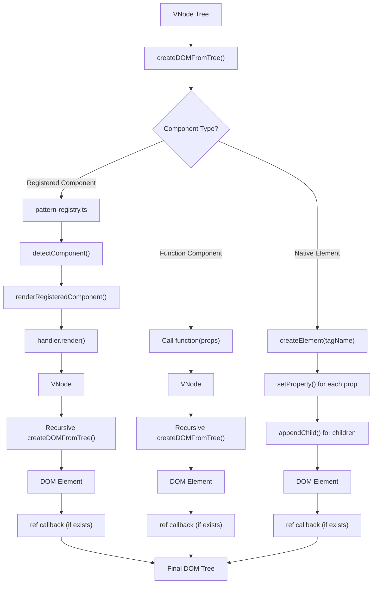

# @fukict/runtime 渲染流程详解

## 🔄 完整渲染流程



**核心说明：**

- **纯渲染引擎**：runtime 专注于 JSX → VNode → DOM 转换，无生命周期概念
- **范式注册机制**：通过 `registerComponentPattern` 支持不同组件模式
- **ref 回调**：DOM 创建完成后的通知机制
- **性能优化**：直接 VNode 到 DOM 映射，无中间层开销

## 📋 详细流程说明

### 1. VNode 树解析

- 接收 JSX 编译后的 VNode 树结构
- 递归遍历每个节点，确定节点类型

### 2. 组件类型识别

- **注册组件**: 通过 `pattern-registry` 检测已注册的编码范式
- **函数组件**: 原生函数组件，直接调用获取 VNode
- **HTML 元素**: 原生 DOM 标签，直接创建 DOM 元素

### 3. 注册组件渲染流程

```
1. detectComponent() - 遍历所有注册的范式处理器
2. handler.detect() - 检测组件是否属于该范式
3. handler.render() - 调用范式处理器渲染组件
4. 返回新的 VNode - 递归调用 createDOMFromTree()
```

### 4. DOM 创建与属性设置

```
1. createElement() - 创建 DOM 元素
2. setProperty() - 设置元素属性 (className, id, data-* 等)
3. setEvents() - 绑定事件监听器 (onClick, onInput 等)
4. appendChild() - 添加子元素
```

### 5. ref 回调机制

```
1. ref 回调触发 - 元素创建完成后
2. DOM 引用传递 - 获取真实 DOM 元素
3. 清理通知 - 元素销毁时 ref(null) 调用
```

## ⚡ 性能优化策略

### 编译时优化

- 静态 VNode 结构预分析
- 事件处理器自动优化
- 属性设置路径优化

### 运行时优化

- 批量 DOM 操作 (`batchUpdate`)
- 精确差异更新 (`updateDOM`)
- 内存自动管理

### 组件范式缓存

- 范式检测结果缓存
- 组件实例复用机制
- WeakMap 自动垃圾回收

## 🔧 扩展机制

### 自定义组件范式

```typescript
registerComponentPattern('CUSTOM_PATTERN', {
  detect: component => component.__CUSTOM_FLAG__,
  render: (component, props, children) => {
    // 自定义渲染逻辑
    return customRenderFunction(component, props, children);
  },
});
```

### ref 回调应用

```typescript
// 通过 ref 回调获取 DOM 引用
const vnode = {
  type: 'div',
  props: {
    /* ... */
  },
  ref: element => {
    if (element) {
      // DOM 元素创建完成
      console.log('Element created:', element);
    } else {
      // DOM 元素即将销毁
      console.log('Element will be destroyed');
    }
  },
};
```
