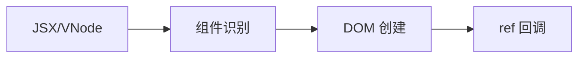

# @fukict/runtime

专注于 Web 客户端渲染的高性能 DOM 库核心包，采用编译时优化 + 运行时渲染的分离架构。

## 🎯 设计理念

- **编译时优化**：通过 Babel 插件将 JSX 转换为优化的 VNode 树结构
- **运行时轻量**：专注于高效的 DOM 创建与更新，核心包 < 10KB gzipped
- **纯客户端**：专为 Web 浏览器环境优化，无 SSR 包袱
- **类型安全**：完整 TypeScript 支持，`.tsx` 文件开箱即用

## 🔄 渲染流程



**核心流程：**

- **组件识别**：区分注册组件、函数组件、HTML元素
- **DOM 创建**：高效的 VNode 到真实 DOM 转换
- **ref 回调**：DOM 创建完成后的通知机制

> 📋 详细技术流程请参考 [RENDERING.md](./RENDERING.md)

## ✨ 核心特性

- 🚀 **高性能渲染**：接近手写 DOM 操作的性能
- 📦 **轻量级体积**：运行时 < 10KB gzipped，编译时优化
- 🔧 **完整工具集**：内置 DOM 操作工具函数和批量更新优化
- 📘 **TypeScript 优先**：全局 JSX 命名空间，无需手动导入
- 🎯 **精确更新**：只更新实际变化的 DOM 节点和属性
- ⚡ **零配置**：`.tsx` 文件无需手动导入即可使用

## 安装

```bash
pnpm add @fukict/runtime
```

## 快速开始

### 基础使用

```typescript
import { h, render } from '@fukict/runtime';

// 使用 h 函数创建 VNode
const app = h(
  'div',
  { class: 'app' },
  h('h1', null, 'Hello Fukict!'),
  h('p', null, 'High-performance client-side rendering'),
);

// 渲染到页面
render(app, {
  container: document.getElementById('root')!,
});
```

### JSX 支持

配置 TypeScript 和 Babel 后，可以直接使用 JSX：

```tsx
// 无需导入，直接使用 JSX
function App() {
  return (
    <div className="app">
      <h1>Hello Fukict!</h1>
      <p>High-performance client-side rendering</p>
    </div>
  );
}

render(<App />, { container: document.getElementById('root')! });
```

## API 参考

### 渲染引擎

#### `render(vnode, options)`

将 VNode 渲染到指定容器。

```typescript
import { render } from '@fukict/runtime';

render(vnode, {
  container: document.getElementById('root')!,
  replace: false, // 是否替换容器内容，默认 false
});
```

#### `createDOMFromTree(vnode)`

将 VNode 树转换为 DOM 元素。

```typescript
import { createDOMFromTree, h } from '@fukict/runtime';

const vnode = h('div', { id: 'test' }, 'Hello');
const domElement = createDOMFromTree(vnode);
```

#### `updateDOM(oldVNode, newVNode, domNode)`

基于新旧 VNode 的差异更新 DOM。

```typescript
import { updateDOM } from '@fukict/runtime';

updateDOM(oldVNode, newVNode, existingDOMNode);
```

### DOM 工具集

```typescript
import {
  appendChild,
  batchUpdate,
  createElement,
  createTextNode,
  removeNode,
  setProperty,
} from '@fukict/runtime';

// 创建元素
const div = createElement('div');

// 批量更新优化
batchUpdate(() => {
  setProperty(div, 'className', 'updated');
  appendChild(div, createTextNode('New content'));
});
```

### VNode 创建

#### `h(type, props, ...children)`

创建 VNode 的辅助函数。

```typescript
import { h } from '@fukict/runtime';

const vnode = h(
  'div',
  { class: 'container', onClick: handleClick },
  h('span', null, 'Child 1'),
  'Text child',
  h('span', null, 'Child 2'),
);
```

### 组件编码范式注册 API

#### `registerComponentPattern(patternName, handler)`

注册组件编码范式处理器。

```typescript
import { registerComponentPattern } from '@fukict/runtime';
import type { ComponentPatternHandler } from '@fukict/runtime';
import { h } from '@fukict/runtime';

const handler: ComponentPatternHandler = {
  // 检测组件是否属于此编码范式
  detect: (component: any) => {
    return component && component.__PATTERN_TYPE__ === 'MY_PATTERN';
  },

  // 渲染组件为 VNode
  render: (component: any, props: any, children: any[]) => {
    // 调用组件的渲染方法，返回 VNode
    const instance = new component(props);
    return instance.render();
  },
};

registerComponentPattern('MY_PATTERN', handler);
```

#### `isRegisteredComponent(component)`

检查组件是否属于已注册的编码范式。

```typescript
import { isRegisteredComponent } from '@fukict/runtime';

const isRegistered = isRegisteredComponent(MyComponent);
console.log(isRegistered); // true 或 false
```

#### `getComponentPattern(component)`

获取组件所属的编码范式名称。

```typescript
import { getComponentPattern } from '@fukict/runtime';

const pattern = getComponentPattern(MyComponent);
console.log(pattern); // 'MY_PATTERN' 或 null
```

#### `renderRegisteredComponent(component, props, children)`

渲染已注册编码范式的组件。

```typescript
import { renderRegisteredComponent } from '@fukict/runtime';

const vnode = renderRegisteredComponent(MyComponent, { prop: 'value' }, []);
// 返回渲染后的 VNode 或 null
```

### 组件支持

```typescript
import type { ComponentFunction } from '@fukict/runtime';
import { h } from '@fukict/runtime';

const Button: ComponentFunction = props => {
  return h(
    'button',
    {
      class: `btn ${props.variant}`,
      onClick: props.onClick,
    },
    props.children,
  );
};

// 使用组件
const app = h(
  Button,
  {
    variant: 'primary',
    onClick: () => console.log('clicked'),
  },
  'Click me',
);
```

### 组件编码范式注册

@fukict/runtime 提供了组件编码范式注册机制，支持第三方组件库通过运行时注册实现自定义的组件编码模式。runtime 包专注于 VNode 到 DOM 的渲染，通过范式注册实现组件的抽象。

#### 注册编码范式处理器

```typescript
import { h, registerComponentPattern } from '@fukict/runtime';
import type { ComponentPatternHandler } from '@fukict/runtime';

// 注册自定义组件编码范式
const handler: ComponentPatternHandler = {
  // 检测函数：判断组件是否属于此编码范式
  detect: (component: any) => {
    return component && component.__PATTERN_TYPE__ === 'CUSTOM_PATTERN';
  },

  // 渲染函数：将组件渲染为 VNode
  render: (component: any, props: any, children: any[]) => {
    // 创建组件实例并调用其渲染方法
    const instance = new component(props);
    return instance.render();
  },
};

registerComponentPattern('CUSTOM_PATTERN', handler);
```

#### 使用示例：Class 组件编码范式

```typescript
import { registerComponentPattern, h, render } from '@fukict/runtime';
import type { VNode } from '@fukict/runtime';

// 1. 定义组件基类
class Component {
  static __PATTERN_TYPE__ = 'CLASS_COMPONENT';
  constructor(public props: any) {}
  abstract render(): VNode;
}

// 2. 注册编码范式
registerComponentPattern('CLASS_COMPONENT', {
  detect: (component: any) => {
    return component.prototype instanceof Component ||
           component.__PATTERN_TYPE__ === 'CLASS_COMPONENT';
  },

  render: (ComponentClass: any, props: any, children: any[]) => {
    const instance = new ComponentClass({ ...props, children });
    return instance.render();
  }
});

// 3. 定义具体组件
class TodoList extends Component {
  render(): VNode {
    return h('div', { class: 'todo-list' },
      h('h2', null, 'Todo List'),
      ...this.props.items.map((item: any) =>
        h('div', { key: item.id }, item.text)
      )
    );
  }
}

// 4. 使用组件
const app = h(TodoList, {
  items: [
    { id: 1, text: 'Learn Fukict' },
    { id: 2, text: 'Build awesome apps' }
  ]
});

render(app, { container: document.getElementById('root')! });
```

#### 内置编码范式

@fukict/runtime 内置支持以下组件编码范式：

- **函数组件**：`ComponentFunction` 类型的函数
- **HTML 元素**：原生 HTML 标签字符串

第三方库可以扩展更多编码范式：

```typescript
// Widget 编码范式（由 @fukict/widget 提供）
registerComponentPattern('WIDGET_CLASS', {
  detect: (component: any) =>
    component.prototype && component.__COMPONENT_TYPE__ === 'WIDGET_CLASS',
  render: (WidgetClass: any, props: any, children: any[]) => {
    const instance = new WidgetClass(props);
    return instance.render();
  },
});

// Factory 编码范式示例
registerComponentPattern('FACTORY_FUNCTION', {
  detect: (component: any) =>
    typeof component === 'function' && component.__FACTORY_TYPE__,
  render: (factory: any, props: any, children: any[]) => {
    return factory(props, children);
  },
});
```

#### API 参考

```typescript
// 注册组件编码范式
function registerComponentPattern(
  patternName: string,
  handler: ComponentPatternHandler,
): void;

// 检查组件是否属于已注册范式
function isRegisteredComponent(component: any): boolean;

// 获取组件所属的编码范式名称
function getComponentPattern(component: any): string | null;

// 渲染已注册编码范式的组件
function renderRegisteredComponent(
  component: any,
  props: any,
  children: any[],
): VNode | null;

interface ComponentPatternHandler {
  // 必需：检测函数
  detect: (component: any) => boolean;
  // 必需：渲染函数，返回 VNode
  render: (component: any, props: any, children: any[]) => VNode;
}
```

## TypeScript 配置

### tsconfig.json

```json
{
  "compilerOptions": {
    "jsx": "preserve",
    "jsxImportSource": "@fukict/runtime",
    "lib": ["DOM", "ES2020"],
    "module": "ESNext",
    "moduleResolution": "bundler"
  }
}
```

### Babel 配置 (babel.config.js)

```javascript
module.exports = {
  presets: [['@babel/preset-typescript']],
  plugins: [
    // 需要配合 @fukict/babel-plugin 使用
    ['@fukict/babel-plugin'],
  ],
};
```

## 类型定义

```typescript
interface VNode {
  type: string | ComponentFunction;
  props: Record<string, any> | null;
  children: VNodeChild[];
  key?: string | number;
}

type VNodeChild = VNode | string | number | boolean | null | undefined;

type ComponentFunction = (props: Record<string, any>) => VNode;

// 组件编码范式相关类型
interface ComponentPatternHandler {
  detect: (component: any) => boolean;
  render: (component: any, props: any, children: any[]) => VNode;
}

type ComponentPattern = string;
```

## 🚀 性能优化策略

### 编译时优化

- **静态模板提取**：识别静态 HTML 部分，生成可复用模板
- **动态插值标记**：标记需要运行时更新的节点位置
- **事件优化**：自动识别可委托的事件处理

### 运行时策略

- **模板克隆**：复用静态模板，减少 DOM 创建开销
- **精确更新**：只更新变化的节点属性/内容
- **批量操作**：使用 `batchUpdate` 自动合并 DOM 操作减少重排重绘
- **内存管理**：自动清理事件监听器和引用

### 使用建议

```typescript
// 批量更新优化
batchUpdate(() => {
  setProperty(element, 'className', 'updated');
  appendChild(element, createTextNode('New content'));
  setProperty(element, 'data-id', '123');
});

// 组件缓存 - 相同 props 的组件会复用渲染结果
const Button = props => h('button', props, props.children);
```

## 浏览器支持

- Chrome >= 60
- Firefox >= 55
- Safari >= 12
- Edge >= 79

## 🔗 相关包

- [`@fukict/babel-plugin`](../babel-plugin) - JSX 编译插件，将 JSX 转换为优化的 VNode 调用
- [`@fukict/widget`](../widget) - 组件开发编码范式，提供 Widget 类和 createWidget 函数
- [`@fukict/babel-preset-widget`](../babel-preset-widget) - Widget 开发预设，开箱即用的 Babel 配置

## 🏗️ 架构说明

`@fukict/runtime` 是整个生态系统的基础设施：

- **底层渲染引擎**：处理 VNode 到真实 DOM 的转换
- **DOM 工具集**：提供高性能的 DOM 操作函数
- **类型支持**：全局 JSX 命名空间和完整 TypeScript 类型
- **组件注册机制**：支持第三方组件编码范式库扩展

## 🎯 使用场景

### 基础层独立使用

`@fukict/runtime` 可以与 `@fukict/babel-plugin` 配合，提供完整的基础 JSX 支持：

```bash
pnpm add @fukict/runtime @fukict/babel-plugin
```

**适合场景**：

- 轻量级应用，需要最小运行时开销
- 性能敏感场景，希望手动控制渲染逻辑
- 作为其他组件库的底层基础设施

### 与增强层配合使用

也可以与 `@fukict/widget` 配合，获得更好的开发体验：

```bash
pnpm add @fukict/widget @fukict/babel-preset-widget
```

**适合场景**：复杂应用、团队开发、需要结构化组件模式

## 许可证

MIT
