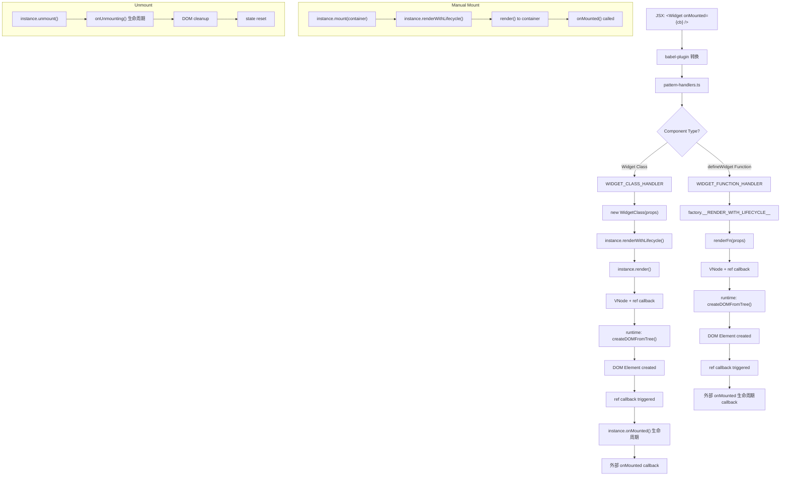

# @fukict/widget 组件生命周期详解

## 🔄 完整组件生命周期流程



## 📋 详细技术流程

### 1. 编译时转换

```
JSX: <Widget prop="value" onMounted={callback} />
↓ babel-plugin
h(Widget, { prop: "value", onMounted: callback }, [])
```

### 2. 组件范式检测

```typescript
// Widget Class 检测
WIDGET_CLASS_HANDLER.detect(Widget) {
  return Widget.prototype && isWidgetClass(Widget);
}

// Function Component 检测
WIDGET_FUNCTION_HANDLER.detect(factory) {
  return factory.__COMPONENT_TYPE__ === 'WIDGET_FUNCTION';
}
```

### 3. Widget Class 渲染流程

```
1. 提取 onMounted 回调从 props
2. 创建 Widget 实例: new WidgetClass(props)
3. 合并生命周期: 外部 onMounted + 内部 onMounted
4. 调用 renderWithLifecycle(): 添加 ref 回调
5. 返回 VNode 给 runtime 包渲染
```

### 4. Function Component 渲染流程

```
1. 提取 onMounted 回调从 props
2. 调用 factory.__RENDER_WITH_LIFECYCLE__
3. 执行 renderFn(props) 获取 VNode
4. 添加 ref 回调处理 onMounted
5. 返回 VNode 给 runtime 包渲染
```

### 5. 生命周期状态管理

#### Widget Class

```typescript
class Widget {
  private _isMounted = false;

  renderWithLifecycle(): VNode {
    const vnode = this.render();
    vnode.ref = element => {
      if (element && !this._isMounted) {
        this.root = element;
        this._isMounted = true;
        this.onMounted(); // 只调用一次
      }
    };
    return vnode;
  }
}
```

#### Function Component

```typescript
const renderWithLifecycle = (props, onMountedCallback) => {
  const vnode = renderFn(props);
  let isMounted = false;

  vnode.ref = element => {
    if (element && !isMounted) {
      isMounted = true;
      onMountedCallback?.(instance); // 只调用一次
    }
  };
  return vnode;
};
```

## 🔧 两种渲染方式对比

### JSX 渲染 (通过 runtime 的组件范式)

```
1. babel-plugin 转换 JSX
2. runtime 调用 pattern-handlers
3. pattern-handlers 调用 renderWithLifecycle
4. ref 回调触发 onMounted
```

### 手动渲染 (直接调用实例方法)

```
1. 手动创建实例: new Widget(props)
2. 调用 instance.mount(container)
3. mount() 内部调用 renderWithLifecycle()
4. ref 回调触发 onMounted
```

**关键：** 两种方式最终都走 `renderWithLifecycle()`，确保生命周期一致

## ⚡ 性能优化实现

### 1. 生命周期防重复调用

```typescript
// Widget Class: 使用实例状态
private _isMounted = false;

// Function Component: 使用闭包状态
let isMounted = false;
```

### 2. 组件实例复用

```typescript
// defineWidget 返回的 factory 可以多次调用
const Button = defineWidget((props) => <button>{props.text}</button>);

// 每次调用都返回新的实例，但共享渲染逻辑
const instance1 = Button({ text: "Click 1" });
const instance2 = Button({ text: "Click 2" });
```

### 3. 内存管理

```typescript
// 自动清理
unmount(): void {
  this.onUnmounting();
  if (this.root?.parentNode) {
    this.root.parentNode.removeChild(this.root);
  }
  this.root = null;
  this.vnode = null;
  this._isMounted = false;
}
```

## 🏗️ 分层架构实现

### Domain + UI 分离

```typescript
// TodoListDomain.ts - 纯业务逻辑
export class TodoListDomain {
  private todos: TodoItem[] = [];
  private onTodosChange?: (todos: TodoItem[]) => void;

  addTodo(text: string): boolean {
    /* ... */
  }
  setTodosChangeHandler(callback: Function) {
    /* ... */
  }
}

// TodoListUI.tsx - UI 层
export class TodoListUI extends Widget<TodoListProps> {
  private domain: TodoListDomain;

  constructor(props: TodoListProps) {
    super(props);
    this.domain = new TodoListDomain(props);
    this.domain.setTodosChangeHandler(this.updateUI.bind(this));
  }

  render() {
    /* JSX UI */
  }
}
```

### 优势

- **关注点分离**: 业务逻辑与UI渲染解耦
- **可测试性**: Domain 层可以独立单元测试
- **可复用性**: Domain 层可以在不同 UI 框架中复用
- **可维护性**: 复杂逻辑不会污染 UI 代码

## 🔍 调试技巧

### 1. 生命周期追踪

```typescript
// 在 onMounted 中添加日志
protected onMounted(): void {
  console.log(`[${this.constructor.name}] 组件已挂载`, this.root);
}
```

### 2. DOM 查询调试

```typescript
// 使用 Widget 的 DOM 查询方法
const element = this.$('.my-selector');
console.log('查询结果:', element?.element);
```

### 3. 组件状态检查

```typescript
// 检查挂载状态
console.log('是否已挂载:', this.isMounted);
console.log('根元素:', this.element);
```
