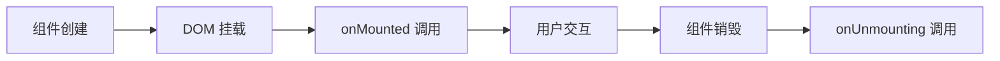
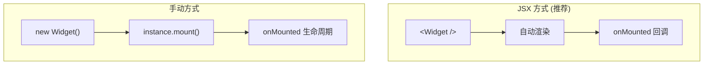
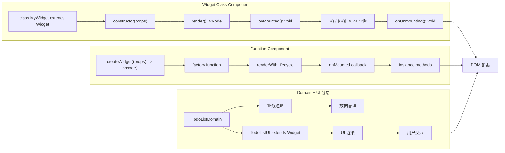

# @vanilla-dom/widget

基于 @vanilla-dom/core 的组件开发编码范式，属于增强层，为复杂应用提供结构化的组件开发模式和更好的开发体验。

## 🚀 特性

- **组件编码范式** - 基于类和函数的组件定义方式
- **自动组件注册** - 配合 babel-plugin 实现自动组件识别
- **分层架构支持** - Domain + UI 分层模式，适合复杂业务逻辑
- **完整 TypeScript 支持** - 类型安全的组件开发
- **灵活的渲染方式** - 支持 JSX 和手动实例化
- **高性能** - 基于原生 DOM 操作，无虚拟 DOM 开销

## 🔄 组件生命周期



**两种使用方式：**



**生命周期特性：**

- ✅ `onMounted` 在任何渲染方式下都只调用一次
- ✅ Widget 类和函数组件都有统一的生命周期管理
- ✅ 支持外部 `onMounted` 回调获取组件实例
- ✅ `onUnmounting` 负责清理资源（事件监听器、定时器等）

> 📋 详细技术流程请参考 [LIFECYCLE.md](./LIFECYCLE.md)

## 📊 组件编码范式对比



### 选择指南

| 特性         | Widget Class                 | Function Component | Domain + UI          |
| ------------ | ---------------------------- | ------------------ | -------------------- |
| **适用场景** | 复杂组件状态管理             | 简单 UI 渲染       | 复杂业务逻辑         |
| **状态管理** | 实例属性                     | props 传递         | Domain 层            |
| **DOM 查询** | `$()` / `$$()`               | 手动 ref           | 分离关注点           |
| **生命周期** | `onMounted` / `onUnmounting` | 外部回调           | Domain + UI 各自管理 |
| **代码组织** | 单文件                       | 单函数             | 多文件分层           |

## 📦 安装

```bash
npm install @vanilla-dom/widget @vanilla-dom/babel-plugin
# 推荐使用 pnpm（更快的包管理）
pnpm add @vanilla-dom/widget @vanilla-dom/babel-plugin

# 或者使用预设，更加简单
npm install @vanilla-dom/widget @vanilla-dom/babel-preset-widget
pnpm add @vanilla-dom/widget @vanilla-dom/babel-preset-widget
```

## 🎯 快速开始

### 1. 简单组件（Widget 类）

```typescript
import { Widget } from '@vanilla-dom/widget';

interface CounterProps {
  initialCount?: number;
}

export class Counter extends Widget<CounterProps> {
  private count: number;

  constructor(props: CounterProps) {
    super(props);
    this.count = props.initialCount || 0;
  }

  private increment() {
    this.count++;
    this.updateDisplay();
  }

  private updateDisplay() {
    const display = this.$('.count-display');
    if (display?.element) {
      display.element.textContent = this.count.toString();
    }
  }

  protected render() {
    return (
      <div className="counter">
        <span className="count-display">{this.count}</span>
        <button on:click={this.increment.bind(this)}>+1</button>
      </div>
    );
  }
}
```

### 2. 函数组件（createWidget）

```typescript
import { createWidget } from '@vanilla-dom/widget';

interface GreetingProps {
  name: string;
  message?: string;
  }

export const Greeting = createWidget((props: GreetingProps) => {
  return (
    <div className="greeting">
      <h1>Hello, {props.name}!</h1>
      {props.message && <p>{props.message}</p>}
    </div>
  );
    });
```

### 3. 复杂组件（分层架构）

对于复杂的业务组件，推荐使用 Domain + UI 分层架构：

```typescript
// TodoListDomain.ts - 业务逻辑层
export class TodoListDomain {
  protected todos: TodoItem[] = [];
  protected onTodosChange?: (todos: TodoItem[]) => void;

  addTodo(text: string): boolean {
    if (!text.trim()) {
      this.notifyError('待办事项不能为空');
      return false;
    }

    const newTodo = { id: Date.now().toString(), text, completed: false };
    this.todos.push(newTodo);
    this.notifyDataChange();
    return true;
  }

  getTodos(): TodoItem[] {
    return [...this.todos];
  }

  setTodosChangeHandler(callback: (todos: TodoItem[]) => void) {
    this.onTodosChange = callback;
  }

  private notifyDataChange() {
    this.onTodosChange?.(this.getTodos());
  }
}
```

```typescript
// TodoListUI.tsx - UI 层
import { Widget } from '@vanilla-dom/widget';
import { TodoListDomain } from './TodoListDomain';

export class TodoListUI extends Widget<TodoListProps> {
  private domain: TodoListDomain;

  constructor(props: TodoListProps) {
    super(props);

    // 组合：创建业务逻辑实例
    this.domain = new TodoListDomain(props);
    this.domain.setTodosChangeHandler(this.handleTodosChange.bind(this));
  }

  private handleAddTodo() {
    const input = this.$('.todo-input');
    if (input?.element) {
      const text = (input.element as HTMLInputElement).value;
      if (this.domain.addTodo(text)) {
        (input.element as HTMLInputElement).value = '';
      }
    }
  }

  private handleTodosChange(todos: TodoItem[]) {
    this.updateTodosList(todos);
  }

  public render() {
    return (
      <div className="todo-list">
        <input className="todo-input" placeholder="添加待办事项..." />
        <button on:click={this.handleAddTodo.bind(this)}>添加</button>
        <ul className="todo-items"></ul>
  </div>
    );
  }
}
```

## 🔧 组件使用

### JSX 中使用（推荐）

配置 babel-plugin 后，可以直接在 JSX 中使用组件：

```typescript
function App() {
  return (
    <div>
      <Counter initialCount={0} />
      <Greeting name="World" message="欢迎使用 Vanilla DOM!" />
      <TodoListUI maxItems={20} />
  </div>
);
}
```

### 手动实例化

```typescript
// 创建组件实例
const counter = new Counter({ initialCount: 5 });
const greeting = Greeting({ name: 'User', message: 'Hello!' });

// 挂载到 DOM
counter.mount(document.getElementById('counter-container'));
greeting.mount(document.getElementById('greeting-container'));

// 销毁组件
counter.destroy();
greeting.destroy();
```

## 📋 配置

### Babel 配置

在项目根目录创建 `.babelrc.js`：

```javascript
module.exports = {
  plugins: ['@babel/plugin-syntax-jsx', '@vanilla-dom/babel-plugin'],
  presets: [
    '@babel/preset-env',
    [
      '@babel/preset-typescript',
      {
        isTSX: true,
        allExtensions: true,
        onlyRemoveTypeImports: true,
      },
    ],
  ],
};
```

### Vite 配置

```typescript
import * as babel from '@babel/core';

import { defineConfig } from 'vite';

export default defineConfig({
  esbuild: {
    jsx: 'preserve', // 让 babel 处理 JSX
  },
  plugins: [
    {
      name: 'vanilla-dom-babel',
      async transform(code, id) {
        if (!/\.(tsx?|jsx?)$/.test(id)) return;
        if (id.includes('node_modules')) return;
        if (!/<[A-Za-z]/.test(code)) return;

        const result = await babel.transformAsync(code, {
          filename: id,
          plugins: ['@babel/plugin-syntax-jsx', '@vanilla-dom/babel-plugin'],
          presets: [
            [
              '@babel/preset-typescript',
              {
                isTSX: true,
                allExtensions: true,
                onlyRemoveTypeImports: true,
              },
            ],
          ],
          sourceMaps: true,
        });

        return {
          code: result?.code || code,
          map: result?.map,
        };
      },
    },
  ],
});
```

## 🏗️ 架构指南

对于复杂组件的开发，建议阅读我们的[组件架构指南](./ARCHITECTURE_GUIDE.md)，其中包含：

- 🎯 **分层架构模式** - Domain + UI 分离设计
- 📝 **最佳实践** - 组件设计原则和规范
- 🔧 **迁移指南** - 从单文件到分层架构的迁移
- 📊 **性能优化** - 组件性能考虑和优化建议

## 📚 API 参考

### Widget 基类

```typescript
class Widget<T = any> {
  constructor(props: T);

  // DOM 查询
  $(selector: string): DOMQuery | null;
  $$(selector: string): DOMBatchQuery;

  // 生命周期
  mount(container: Element): void;
  destroy(): void;
  protected onMounted(): void;
  protected onDestroyed(): void;

  // 渲染
  public render(): VNode;
}
```

### createWidget 函数

```typescript
function createWidget<T>(render: (props: T) => VNode): SimpleWidgetFactory<T>;
```

### 类型定义

```typescript
interface WidgetProps {
  [key: string]: any;
}

interface ComponentMountCallback<T> {
  (instance: T): void;
}

interface SimpleWidgetInstance {
  mount(container: Element): void;
  destroy(): void;
  element: Element | null;
}
```

## 🔗 相关包

- [@vanilla-dom/core](../core) - 核心渲染引擎
- [@vanilla-dom/babel-plugin](../babel-plugin) - JSX 编译插件

---

**注意**: `@vanilla-dom/widget` 不是一个框架，而是一套组件开发编码范式。它提供了基于 `@vanilla-dom/core` 的结构化组件开发方式，包括 Widget 基类、createWidget 工厂函数和分层架构模式，帮助开发者以一致的方式构建可维护的组件。

## �� 许可证

MIT License
